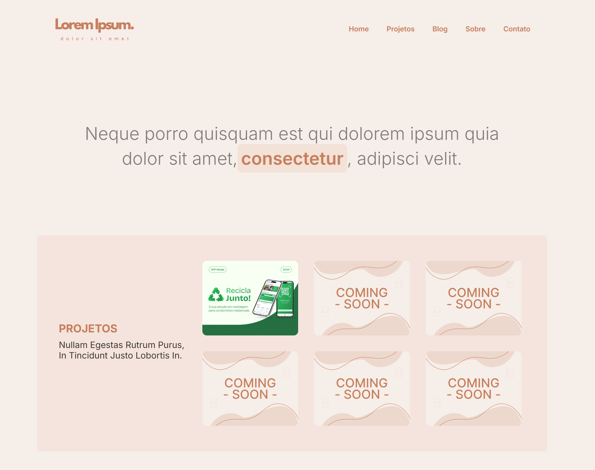

# 🌸 Website HTML & CSS - Coderhouse

Este repositório contém o projeto desenvolvido durante o curso de **HTML e CSS** da Coderhouse (Turma 63580) ministrado por [@KlaytonJr](https://github.com/KlaytonJr).

## 📄 Descrição
O projeto é uma página web "one page" responsiva que apresenta:

- 📌 **Seções**: Home, Projetos, Blog, Sobre e Contato.
- 🎨 **CSS**: Uso da fonte *Inter*, animações e layout flexível.
- 🌍 **SEO**: Metatags, Open Graph e semântica HTML.
- 🔗 **Redes Sociais**: GitHub, LinkedIn, Medium, entre outros.

## 🚀 Tecnologias
- **HTML5**
- **CSS3**
- **Google Fonts**
- **Font Awesome**

## 📸 Captura de Tela


## 🎯 Como Usar
1. Clone este repositório:
   ```sh
   git clone https://github.com/tinastdot/ch-website.git
   ```
2. Acesse a pasta do projeto:
   ```sh
   cd ch-website
   ```
3. Abra o arquivo `index.html` no navegador.

## 📬 Contato
🔗 [LinkedIn](https://www.linkedin.com/in/tina-s-santos)

📧 [E-mail](mailto:tinast.wrk@gmail.com)

---
🐼 **Desenvolvido por Tina Santos**

